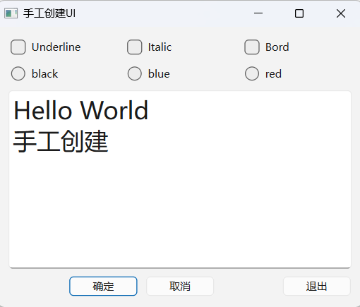

# 代码化UI设计

窗口界面的可视化设计是对用户而言的，UI文件都会被UIC转换为c++程序文件。如果不使用`Qt Designer`进行UI可视化设计，直接编写c++代码也是可以创建界面的，而且某些界面效果是可视化设计无法实现的。如果习惯了用纯代码的方式设计界面，就可以采用纯代码的方式创建界面。Qt自带的示例项目基本都是用纯代码的方式创建UI。

请看以下示例：

我们的目标是创建以下效果的对话框:



创建一个Qt Widget项目，继承自`QDialog`。

* Dialog类的定义：

  ```c++
  class Dialog : public QDialog
  {
      Q_OBJECT
  
  public:
      Dialog(QWidget *parent = nullptr);
      ~Dialog();
  
  private:
      //三个复选框
      QCheckBox* chk_under;
      QCheckBox* chk_italic;
      QCheckBox* chk_bord;
      //三个单选按钮
      QRadioButton* radio_black;
      QRadioButton* radio_red;
      QRadioButton* radio_blue;
      //三个按钮
      QPushButton* btn_ok;
      QPushButton* btn_cancel;
      QPushButton* btn_close;
      //文本UI
      QPlainTextEdit* text_edit;
  
      //UI创建与初始化
      void init_ui();
      //初始化信号与槽的连接
      void init_slot_signal();
  
  private slots:
      //三个复选框
      void do_chk_under(bool checked);
      void do_chk_italic(bool checked);
      void do_chk_bord(bool checked);
      //设置文字颜色
      void do_set_color();
  
  };
  ```

* 三个控制字体的复选框的槽函数的实现如下:

  ```c++
  void Dialog::do_chk_under(bool checked)
  {
      QFont font = text_edit->font();
      font.setUnderline(checked);
      text_edit->setFont(font);
  }
  
  void Dialog::do_chk_italic(bool checked)
  {
      QFont font = text_edit->font();
      font.setItalic(checked);
      text_edit->setFont(font);
  }
  
  void Dialog::do_chk_bord(bool checked)
  {
      QFont font = text_edit->font();
      font.setBold(checked);
      text_edit->setFont(font);
  }
  ```

* 界面组件的创建与布局

  函数`init_ui`实现界面的创建与布局：

  ```c++
  void Dialog::init_ui()
  {
      //创建三个复选框，并水平布局
      chk_under = new QCheckBox("Underline");
      chk_italic = new QCheckBox("Italic");
      chk_bord = new QCheckBox("Bord");
      auto chk_h_layout = new QHBoxLayout();
      chk_h_layout->addWidget(chk_under);
      chk_h_layout->addWidget(chk_italic);
      chk_h_layout->addWidget(chk_bord);
  
      //创建三个单选按钮，并水平布局
      radio_black = new QRadioButton("black");
      radio_blue = new QRadioButton("blue");
      radio_red = new QRadioButton("red");
      auto radio_h_layout = new QHBoxLayout();
      radio_h_layout->addWidget(radio_black);
      radio_h_layout->addWidget(radio_blue);
      radio_h_layout->addWidget(radio_red);
  
      //创建三个按钮，并水平布局
      btn_cancel = new QPushButton("取消");
      btn_close = new QPushButton("退出");
      btn_ok = new QPushButton("确定");
      auto btn_h_layout = new QHBoxLayout();
      btn_h_layout->addStretch();
      btn_h_layout->addWidget(btn_ok);
      btn_h_layout->addWidget(btn_cancel);
      btn_h_layout->addStretch();
      btn_h_layout->addWidget(btn_close);
  
      //创建文本框，并初始化字体；
      text_edit = new QPlainTextEdit;
      text_edit->setPlainText("Hello World\n手工创建");
      QFont font = text_edit->font();
      font.setPointSize(20);
      text_edit->setFont(font);
  
      //创建主窗口布局。
      auto main_layout = new QVBoxLayout(this);
      main_layout->addLayout(chk_h_layout);
      main_layout->addLayout(radio_h_layout);
      main_layout->addWidget(text_edit);
      main_layout->addLayout(btn_h_layout);
      setLayout(main_layout);
  }
  ```

  此函数按吮吸完成了如下操作：

  * 创建三个`QCheckBox`组件，这三个组件的指针已经定义为`Dialog`类的私有变量，然后创建一个水平布局，将这三个复选框添加到这个水平布局里。
  * 创建三个`QRadioButton`组件和一个水平布局，并将三个单选按钮添加进水平布局里。
  * 创建三个`QPushButton`组件和一个水平布局，并将三个按钮添加进水平布局里。
  * 创建一个`QPlainTextEdit`组件，设置其文字内容和字体。
  * 创建一个垂直布局，并插入之前创建的三个水平布局和一个文本框，设置这个垂直布局为窗口的主布局。

* 颜色设置的槽函数实现:

  ```C++
  void Dialog::do_set_color()
  {
      QColor selected_color;
      if(radio_black->isChecked())
      {
          selected_color = Qt::black;
      }
      else if(radio_blue->isChecked())
      {
          selected_color = Qt::blue;
      }
      else if(radio_red->isChecked())
      {
          selected_color = Qt::red;
      }
      else
      {
          return;
      }
  
      QTextCursor cursor(text_edit->document());
      cursor.select(QTextCursor::Document);
      QTextCharFormat format;
      format.setForeground(selected_color);
      cursor.mergeCharFormat(format);
  
      cursor.clearSelection();
      text_edit->setTextCursor(cursor);
  }
  ```

* 信号与槽的连接在`init_slot_signal`函数中实现：

  ```c++
  void Dialog::init_slot_signal()
  {
      //设置颜色
      connect(radio_black, &QRadioButton::clicked, this, &Dialog::do_set_color);
      connect(radio_blue, &QRadioButton::clicked, this, &Dialog::do_set_color);
      connect(radio_red, &QRadioButton::clicked, this, &Dialog::do_set_color);
  
      //设置样式
      connect(chk_bord, &QCheckBox::clicked, this, &Dialog::do_chk_bord);
      connect(chk_italic, &QCheckBox::clicked, this, &Dialog::do_chk_italic);
      connect(chk_under, &QCheckBox::clicked, this, &Dialog::do_chk_under);
  
      //按钮与窗口槽函数关联。
      connect(btn_ok, &QPushButton::clicked, this, &Dialog::accept);
      connect(btn_cancel, &QPushButton::clicked, this, &Dialog::reject);
      connect(btn_close, &QPushButton::clicked, this, &Dialog::close);
  }
  ```

布局对象就是这个布局内的所有组件的父容器，例如第一个水平布局是三个复选框的父容器。最后创建的垂直布局以窗口作为父容器，因为在创建垂直布局时以`this`作为其`parent`参数。而这个垂直布局是是文本框和其他几个水平布局的父容器，所以，窗口中的这些组件都有父容器，且最终的父容器就是窗口。

我们在`Dialog`类的析构函数中没有显示地删除`private`部分定义的对象，因为Qt中容器组件被删除时，其内部组件也会被自动删除。因此，窗口被删除时，窗口中的所有组件都会被自动删除。

采用纯代码方式创建UI比较复杂，需要对组件的布局有完整的规划，不如可视化设计直观，且编写的代码量大。对每组信号与槽都要用`connect`连接，不像可视化设计那样可以自动连接。但是，有些界面效果无法用可视化设计方法实现，例如在基于`QMainWindow`的窗口上无法可视化地在状态栏上添加`QLabel`、`QSpinBox`等组件，那么需要在窗口的构造函数里用代码创建这些组件，实现需要的界面效果。