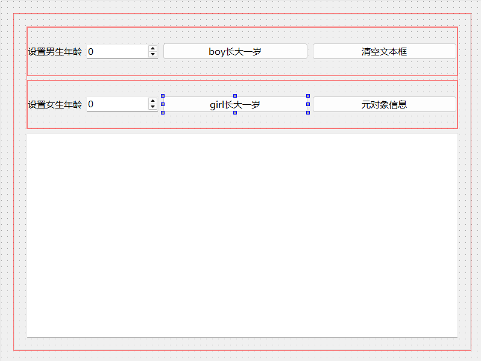

# Qt的元对象系统

Qt中引入了元对象系统对标准c++进行扩展，增加了信号与槽、属性系统、动态翻译等特性，为编写GUI应用程序提供了极大的方便，

## 元对象系统概述

Qt的元对象系统的功能建立在以下三个方面：

* `QObject`类时所有使用元对象系统的类的基类。
* 必须在一个类的开头部分插入宏`Q_OBJECT`，这样这个类才可以使用元对象系统的特性。
* MOC为每个`QObject`的子类提供必要的代码来实现元对象系统的特性。

构建项目时，MOC会读取c++源文件，当它发现类的定义里有`Q_OBJECT`宏时，他就会为这个类生成另一个包含元对象支持代码的c++源文件，这个生成的源文件连同类的实现文件一起被标准c++编译器编译和链接。

1. `QObject`类

   `QObject`类是所有使用元对象系统的类的基类，也就是说，如果一个类的父类或上层父类是`QObject`，它就可以使用信号与槽、属性等特性。下面是`QObject`类与元对象系统特性相关的一些接口函数，表中只列出了函数的返回值：

   |   特性   |                    函数                    |                   功能                    |
   | :------: | :----------------------------------------: | :---------------------------------------: |
   |  元对象  |        `QMetaObject* metaObject()`         |           返回这个对象的元对象            |
   |  元对象  |       `QMetaObject staticMetaObject`       |    这是类的静态变量，储存了类的元对象     |
   | 类型信息 |             `bool inherits()`              |   判断这个对象是不是某个类的子类的实例    |
   | 动态翻译 |               `QString tr()`               |  类的静态函数，返回一个字符串的翻译版本   |
   |  对象树  |         `QObjectList& children()`          |              返回子对象列表               |
   |  对象树  |            `QObject* parent()`             |              返回父对象指针               |
   |  对象树  |             `void setParent()`             |                设置父对象                 |
   |  对象树  |              `T findChild()`               | 按照对象名称，查找可被转换为类型T的子对象 |
   |  对象树  |         `QList<T> findChildren()`          |    返回符合名称和类型条件的子对象列表     |
   | 信号与槽 |    `QMetaObject::Connection connect()`     |             设置信号与槽关联              |
   | 信号与槽 |            `bool disconnect()`             |            解除信号与槽的关联             |
   | 信号与槽 |           `bool blockSignals()`            |       设置是否阻止对象发射任何信号        |
   | 信号与槽 |          `bool signalsBlocked()`           |  若返回值为true，表示对象被阻止发射信号   |
   | 属性系统 | `QList<QByteArray> dynamicPropertyNames()` |           返回所有动态属性名称            |
   | 属性系统 |            `bool setProperty()`            |        设置属性值，或添加动态属性         |
   | 属性系统 |           `QVariant property()`            |                返回属性值                 |

   元对象系统的特性是通过`QObject`的一些函数实现的。

   1. 元对象（meta object）。每个`QObject`对象及其子类的实例都有一个元对象，这个元对象是自动创建的。静态变量`staticMetaObject`就是这个元对象，函数`metaObject()`返回这个元对象指针。
   2. 类型信息。`QObject`的`inherits()`函数可以判断对象是不是从某个类继承的类的实例。
   3. 动态翻译。函数`tr()`用于返回一个字符串的翻译版本，在设计多语言界面的应用程序时需要用到`tr()`函数。
   4. 对象树（object tree）。对象树指的是表示对象间从属关系的树状结构。`QObject`类的`parent()`函数返回其父对象，`children()`函数其子对象，`findChildren`函数可以返回某些子对象或所有子对象。窗口和窗口上的组件构成对象树，窗口可以访问任何一个界面组件。对象树中的某个对象被删除时，它的子对象会被自动删除，所以，当一个窗口被删除时，它上面的所有界面组件也都会被自动删除。
   5. 信号与槽。通过在一个类中插入宏`Q_OBJECT`，就可以使用Qt扩展的c++语言特性编程，例如在一个类中定义属性、类信息、信号和槽函数。
   6. 属性系统。在类的定义代码中可以用宏`Q_PROPERTY`定义属性，`QObject`的`setProperty()`函数会设置属性的值或定义动态属性，`property()`函数会返回属性的值。

2. `QMetaObject`类

   每个`QObject`类及其子类的实例都有一个自动创建的元对象，元对象时`QMetaObject`类型的实例。元对象储存了类的实例所属类的各种元数据，包括类信息元数据、方法元数据、属性元数据等，所以，元对象实质上是对类的描述。

   `QMetaObject`类的主要接口函数如下，表中列出了函数原型，但是省略了输入参数以及函数前后的`const`关键字。当参数太多时不方便输入，就用“****”代替。

   > 表格中的“这个元对象”指的是一个`QObject`实例的元对象，“这个类”指的是元对象所描述的类。

   |      分组      |                    函数原型                    |                             功能                             |
   | :------------: | :--------------------------------------------: | :----------------------------------------------------------: |
   |    类的信息    |              `char* className()`               |                      返回这个类的类名称                      |
   |    类的信息    |             `QMetaType metaType()`             |                    返回这个元对象的元类型                    |
   |    类的信息    |          `QMetaObject* superClass()`           |                 返回这个类的上层父类的元对象                 |
   |    类的信息    |    `bool inherits(QMetaObject* metaObject)`    |         返回true表示这个类继承子`metaObject`描述的类         |
   |    类的信息    |          `QObject* newInstance(****)`          |     创建这个类的一个实例，可以给构造函数传递最多10个参数     |
   |  类信息元数据  |     `QMetaClassInfo classInfo(int index)`      | 返回序号为index的一条类信息的元数据，类信息时在类中用宏`Q_CLASSINFO`定义的一条信息 |
   |  类信息元数据  |       `int indexOfClassInfo(char* name)`       |  返回名称为name的类信息的序号，序号可用于`classInfo()`函数   |
   |  类信息元数据  |             `int classInfoCount()`             |                    返回这个类的类信息条数                    |
   |  类信息元数据  |            `int classInfoOffset()`             |                 返回这个类的第一条类信息序号                 |
   | 构造函数元数据 |            `int constructorCount()`            |                   返回这个类的构造函数个数                   |
   | 构造函数元数据 |      `QMetaMethod constructor(int index)`      |          返回这个类的序号为index的构造函数的元数据           |
   | 构造函数元数据 |  `int indexOfConstructor(char* constructor)`   | 返回一个构造函数序号，constructor包括正则化之后的函数名和参数名 |
   |   方法元数据   |        `QMetaMethod method(int index)`         |                返回序号为index的方法的元数据                 |
   |   方法元数据   |              `int methodCount()`               | 返回这个类的方法的个数，包括基类中定义的方法，方法包括一般的成员函数，还包括信号和槽 |
   |   方法元数据   |              `int methodOffset()`              |                 返回这个类的第一个方法的序号                 |
   |   方法元数据   |       `int indexOfMethod(char* method)`        |                 返回名称为method的方法的序号                 |
   | 枚举类型元数据 |       `QMetaEnum enumerator(int index)`        |              返回序号为index的枚举类型的元数据               |
   | 枚举类型元数据 |            `int enumeratorCount()`             |                   返回这个类的枚举类型个数                   |
   | 枚举类型元数据 |            `int enumeratorOffset()`            |               返回这个类的第一个枚举类型的序号               |
   | 枚举类型元数据 |      `int indexOfEnumerator(char* name)`       |                 返回名称为name的枚举类型序号                 |
   |   属性元数据   |      `QMetaProperty property(int index)`       |                返回序号为index的属性的元数据                 |
   |   属性元数据   |             `int propertyCouunt()`             |                    返回这个类的属性的个数                    |
   |   属性元数据   |             `int propertyOffset()`             |                 返回这个类的第一个属性的序号                 |
   |   属性元数据   |       `int indexOfProperty(char* name)`        |                  返回名称为name的属性的序号                  |
   |    信号与槽    |       `int indexOfSignal(char* signal)`        |                 返回名称为signal的信号的序号                 |
   |    信号与槽    |         `int indexOfSlot(char* slot)`          |                 返回名称为slot的槽函数的序号                 |
   |    静态函数    |         `bool checkConnectArgs(****)`          |                检查信号与槽函数的参数是否兼容                |
   |    静态函数    |   `void connectSlotsByName(QObject* object)`   |    迭代搜索object的所有子对象，将匹配到的信号和槽连接起来    |
   |    静态函数    |           `bool invokeMethod(****)`            |     运行`QObject`对象的某个方法，包括信号、槽或成员函数      |
   |    静态函数    | `QByteArray normalizedSignature(char* method)` | 将方法method的名称和参数字符串正则化，去除多余空格。函数返回的结果可用于`checkConnectArgs()`、`indexOfConstructor()`等函数。 |

   通过`QMetaObject`类的这些函数，我们可以在运行时获取一个`QObject`对象的类信息和各种元数据。例如，函数`className()`可返回类的名称，函数`superClass()`可返回其父类的元对象，函数`newInstace()`可以创建元对象所描述类的一个新的实例。

   类的元数据又分为多种类型，且又专门的类来描述。例如，函数`property()`返回属性的元数据，属性元数据用`QMetaProperty`类描述，它的接口函数描述了属性的各种特性，如函数`name()`返回属性名称，函数`type()`返回属性数据类型。

## 运行时类型信息

通过使用`QObject`和`QMetaObject`提供的以下一些接口函数，我们可以在运行时获得一个对象的类名称以及其父类的名称，判断是否熊某个类继承而来。要实现这些功能，我们并不需要c++编译器的运行时类型信息（run-time type information, RTTI）支持。

1. 函数`QMetaObject::className()`。这个函数可以在运行时返回类名称的字符串，例如：

   ```c++
   QPushButton* btn = new QPushButton();
   const QMetaObject* meta = btn->metaObject();
   QString str = QString(meta->className());		//str = "QPushButton"
   ```

2. 函数`QObject::inherits()`。这个函数可以判断一个对象是不是继承自某个类的实例，顶层的父类是`QObject`。例如：

   ```c++
   QPushButton* btn = new QPushButton();
   bool result = btn->inherits("QPushButton");	//true
   result = btn->inherits("QObject");			//true
   result = btn->inherits("QWidget");			//true
   result = btn->inherits("QCheckBox");		//false
   ```

3. 函数`QMetaObject::superClass()`。这个函数返回该元对象所描述类的父类的元对象，通过父类的元对象可以获取父类的一些元数据，例如：

   ```c++
   QPushButton* btn = new QPushButton();
   const QMetaObject* meta = btn->metaObject();
   QString str1 = QString(meta->className());	//str1 = "QPushButton"
   
   const QMetaObject* metaSuper = btn->metaObject()->superClass();
   QString str2 = QString(metaSuper->className());	//str2 = "QAbstractButton"
   ```

4. 函数`qobject_cast`。这个函数是头文件`<QObject>`中定义的一个非成员函数，对于`QObject`及其子类的对象，可以使用函数`qobject_cast`进行动态类型转换。如果自定义的类要支持函数`qobject_cast`，那么自定义的类需要直接或间接继承自`QObject`，且在类定义中插入宏`Q_OBJECT`。例如:

   ```c++
   QObject* btn = new QPushButton();
   const QMetaObject* meta = btn->metaObject();
   QString str1 = QString(meta->className());	//str1 = "QPushButton"
   
   QPushButton* btnPush = qobject_cast<QPushButton*>(btn);	//转换成功
   const QMetaObject* meta2 = btnPush->metaObject();
   QString str2 = QString(meta2->className());	//str2 = "QPushButton"
   
   QCheckBox* chkBox = qobject_cast<QPushButton*>(btn);	//转换失败，chkBox是nullptr
   ```

   标准c++语言中又类似的强制转换类型`dynamic_cast()`，使用`qobject_cast()`的好处是不需要c++编译器开启RTTI支持。

## 属性系统

1. 属性定义

   属性是Qt c++的一个扩展的特性，是基于元对象系统实现的，标准c++语言中没有属性。在`QObject`的子类中，我们可以使用宏`Q_PROPERTY`定义属性，其格式如下：

   ```c++
   Q_PROPERTY(type name
             	(READ getFunction [WRITE setFunction] |
                MEMBER memberName [(READ getFuntion | WRITE setFunction)])
             	[RESET resetFuntion]
             	[REVISION int | REVISION(int [, int])]
              	[NOTIFY notifySignal]
             	[DESIGNABLE bool]
             	[SCRIPTABLE bool]
             	[STORED bool]
             	[USER bool]
             	[BINDABLE bindableProperty]
             	[CONSTANT]
             	[FINAL]
             	[REQUIRED])
   ```

   宏`Q_PROPERTY`定义一个值类型为type，名称为name的属性，用READ、WRITE关键字分别定义属性的读取、写入函数，还有一些其他关键字用于定义属性的一些操作特性。属性值的类型可以是`QVariant`支持的任何类型，也可以是自定义类型。

   宏`Q_PROPERTY`定义属性的一些主要关键字的含义如下：

   * READ：指定一个读取属性值的函数，没有MEMBER关键字时必须设置READ。
   * WRITE：指定一个设置属性值的函数，只读属性没有WRITE配置。
   * MEMBER：指定一个成员变量与属性关联，使之称为可读可写的属性，指定后无需再设置READ和WRITE。
   * RESET：是可选的，用于指定一个设置属性默认值的函数。
   * NOTIFY：是可选的，用于设置一个信号，当属性值发生变化时发射此信号。
   * DESIGNAVLE：表示属性是否在Qt Designer的属性编辑器里可见，默认值为true。
   * USER：表示这个属性是不是用户可编辑的属性，默认值为false，通常一个类只有一个USER设置为true的属性，例如`QAbstractButton`的`checked`属性。
   * CONSTANT：表示属性值是一个常数，对于一个对象实例，READ指定的函数返回值是常数，但是每个实例的返回值可以不一样。具有CONSTANT关键字的属性不能有WRITE和NOTIFY关键字。
   * FINAL：表示所定义的属性不能被子类重载。

   例如，下面时`QWidget`类定义属性的一些例子：

   ```c++
   Q_PROPERTY(bool focus READ hasFocus)
   Q_PROPERTY(bool enabled READ isEnabled WRITE setEnabled)
   Q_PROPERTY(QCursor cursor READ cursor WRITE setCursor RESET unsetCursor)
   ```

2. 属性的使用

   在Qt类库中，很多基于`QObject`的类都定义了属性，特别是基于`QWidget`的界面组件类。Qt Designer的属性编辑器显示了一个界面组件的各种属性，我们可以在进行UI可视化设计时修改组件的属性值。可读可写的属性值通常有一个用于读取属性值的函数，函数名一般与属性名相同。还有一个用于设置属性值的函数，函数名一般是在属性名前面加“set”。例如`QLable`有一个text属性，这个属性对应的读取和设置属性值的函数定义如下：

   ```c++
   QString QLable::text();
   void QLable::setText(const QString&);
   ```

   在编程时，我们一般是使用属性的读取和设置函数来访问属性值。

   `QObject`类提供了两个函数直接通过属性名字字符串来访问属性，其中`QObject::property()`函数读取属性值，`QObject::setProperty()`函数设置属性值。例如下面一段代码：

   ```c++
   bool isFlat = ui->btnProperty->property("flat").toBool();	//通过属性名读取属性值
   ui->btnProperty->setProperty("flat", !isFlat);				//通过属性名设置属性值
   ```

   其中`ui->btnProperty`表示窗口上的一个`QPushButton`按钮。注意，`QObject::property()`函数的返回值是`QVariant`类型，需要转换为具体的类型。

   `QMetaObject`类的一些函数可以提供元对象所描述类的属性元数据，属性元数据用`QMetaProperty`类描述，它有各种函数可反映属性的一些特性，例如下面一段代码：

   ```c++
   const QMetaObject* meta = ui->spinBoy->metaObject();	//获取一个spinbox的元对象
   int index = meta->indexOfProperty("value");				//获取属性value的序号
   QMetaProperty prop = meta->property(index);				//获取value的元数据
   bool res = prop.isWritable();							//属性是否可写，值为true
   res = prop.isDesignable();								//属性是否可设计，值为true
   res = prop.hasNotifySignal();							//属性是否有反映属性值变化的信号，值为true
   ```

3. 动态属性

   函数`QObject::setProperty()`设置属性值时，如果属性名称不存在，就会为对象定义一个新的属性并设置属性值，这时定义的属性称为动态属性。动态属性时针对类的实例定义的，所以只能使用函数`QObject::property()`读取动态属性的属性值。

   可以根据需要灵活使用动态属性。例如，一个窗口上有多个组件与数据库表的字段关联，这些组件用于输入数据，如果某些字段时必填字段，我们就可以在初始化界面时为这些字段的关联显示组件定义一个新的`required`属性，并设置为true，例如：

   ```c++
   editName->setProperty("required", true);
   combosex->setProperty("required", true);
   checkAgree->serProperty("required", true);
   ```

4. 附加的类信息

   元对象系统还支持使用宏`QCLASSINFO()`在类中定义一些类信息，类信息有名称和值，值只能用字符串表示，例如：

   ```c++
   class QMyclass : public QObject
   {
       Q_OBJECT
       Q_CLASSINFO("author", "wang")
       Q_CLASSINFO("compant", "UPC")
       Q_CLASSINFO("version", "3.0.1")
       
   public:
       ...
   };
   ```

   使用`QMetaObject`的一些函数可以获取类信息元数据。一条类信息用`QMetaClassInfo`类描述，这个类只有两个函数，函数原型定义如下：

   ```c++
   char* QMetaClassInfo::name();
   char* QMetaClassInfo::value();
   ```


## 信号与槽

* connect有一种成员函数形式，多种静态函数形式，一般使用静态函数形式。常见的有以下两种：

  ```c++
  connect(sender, SIGNAL(signal()), receiver, SLOT(slot()));
  ```

  如果信号和槽带有参数，还需注明：

  ```
  connect(sender, SIGNAL(signal(int)), receiver, SLOT(slot(int)));
  ```

  对于具有默认参数的信号，即信号名称是唯一的，不存在其他不同的其他同名函数，可以使用函数指针的形式进行关联：

  ```c++
  connect(lineEdit, &QLineEdit::textChanged, this, &Widget::do_textChanged);
  ```

  `QCheckBox`的clicked信号定义如下：

  ```c++
  void QCheckBox::clicked(bool checked = false)
  ```

  

  在`QCheckBox`组件的Go to slot对话框中会出现两个同名函数：clicked(),clicked(bool)。

  若是与之相连的槽函数不同名，且参数不同，则按函数指针形式进行连接不会出现问题：

  ```c++
  connect(ui->checkBox, &QCheckBox::clicked, this, &Widget::do_checked);
  connect(ui->checkBox, &QCheckBox::clicked, this, &Widget::do_checked_NoParam);
  ```

  若是定义的两个槽函数重载:

  ```c++
  void do_clicked(bool checked);
  void do_clicked();
  ```

  这时再使用函数指针的形式连接就会出现问题，因为它不知道哪个信号应当匹配哪个槽函数。这时需要`qOverload`来明确参数类型：

  ```c++
  connect(ui->checkBox, &QCheckBox::clicked, this, qOverload<bool>(&Widget::do_checked));
  connect(ui->checkBox, &QCheckBox::clicked, this, qOverload<>(&Widget::do_checked));
  ```

  不管是哪种参数形式的connect，最后都有一个参数type，它是枚举类型`Qt::ConnectionType`，表示信号与槽的关联方式，默认值为`Qt::AutoConnection`。

  * `Qt::AutoConnection`：如果信号的接收者与发射者在同一个线程中，就使用`Qt::DirectConnection`，否则使用`Qt::QueuedConnection`方式，在信号发射时自动确认关联方式。
  * `Qt::DirectConnection`：信号被发射时槽函数立即执行，槽函数与信号在同一个线程中。
  * `Qt::QueuedConnection`：在事件循环回到接收者线程中后运行槽函数，槽函数与信号在不同的线程中。
  * `Qt::BlockingQueuedConnection`：与`Qt::QueuedConnection`相似，区别是信号线程会阻塞，直到槽函数运行完毕。当信号与槽函数在同一个线程中绝对不能使用这种方式，否则会造成死锁。

* `disconnect()`函数的使用

  > 以下示例中都会使用静态函数和成员函数两种形式。

  * 解除与一个发射者所有信号的连接：

    ```c++
    disconnect(myObject, nullptr, nullptr, nullptr);
    myObject->disconnect();
    ```

  * 解除与一个特定信号的所有连接：

    ```c++
    disconnect(myObject, SIGNAL(mySignal()), nullptr, nullptr);
    myObject->disconnect(SIGNAL(mySignal()));
    ```

  * 解除一个特定接收者的所有连接：

    ```c++
    disconnect(myObject, nullptr, myReceiver, nullptr);
    myObject->disconnect(myReceiver);
    ```

  * 解除特定的一个信号与槽的连接

    ```c++
    disconnect(lineEdit, &QLineEdit::textChanged, label, &QLable::setText);
    ```

* 使用`sender()`函数获取信号发射者

  `sender()`是`QObject`类的一个protected函数，在一个槽函数里调用可以获取信号发射者的`QObject`对象指针。如果知道信号发射者的类型，我们就可以将`QObject`指针转换为确定类型对象的指针，然后使用这个确定类的接口函数。例如:

  ```c++
  void Widget::on_btnProperty_clicked()
  {
      QPushButton* btn = qobject_cast<QPushButton*>(sender());
      bool isFlat = btn->property("flat").toBool();
      btn->setProperty("flat", !isFlat);
  }
  ```

## 对象树

使用`QObject`及其子类创建的对象是以对象树的形式来组织的。创建一个`QObject`对象时若设置一个父对象，它就会被添加到父对象的子对象列表里。一个父对象被删除时，其全部子对象就会被自动删除。

`QObject`类的构造函数里有一个参数parent，用于设置对象的父对象。`QObject`类有一些函数可以在运行时访问对象树中的对象，例如：

* `children()`。这个函数返回对象的子对象列表。

  假设串口上有一个分组框`groupBox_Btns`里有四个水平布局的`QPushButon`按钮，可以通过下面的代码修改这些按钮的文字：

  ```c++
  QObjectList objList = ui->groupBox_Btns->children();
  for(int i = 0; i < objList.size(); i++)	//列表中有五个元素
  {
      const QMetaObject* meta = objList.at(i)->metaObject();	//获取元对象
      QString className = QString(meta->className());
      if(className == "QPushButton")
      {
          QPushButton* btn = qobject_cast<QPushButton*>(objList.at(i));
          QString str = btn->text();
          btn->setText(str+"*");
      }
  }
  ```

  > 因为分组框中还有一个水平布局，所以需要检查类型名称。

* `findChild()`。这个函数用于在对象的子对象中查找可以转换为类型T的子对象。其原型定义如下：

  ```c++
  template <typename T> T QObject::findChild(const QString& name = QString(),
                                            	Qt::FindChildOptions options = Qt::FindChildrenRecursively)
  ```

  参数name是子对象的名称，options表示查找方式，默认为`Qt::FindChildrenRecursively`，表示在子对象中递归查找，也就是会查找子对象的子对象，若设置为`Qt::FindDirectChildrenOnly()`表示只查找直接子对象。

  例如，我们要查找窗口上对象为`tnOk`的`QPushButton`按钮：

  ```c++
  QPushButton* btn = this->findChild<QPushButton*>("btnOk");
  ```

* `findChildren()`。这个函数用于在对象的子对象中查找可以转换为类型T的子对象，可以指定对象名称，还可以使用正则表达式来匹配对象名称。

  例如下面的代码实现了`children()`实例代码的功能：

  ```c++
  QList<QPushButton*> btnList = ui->groupBox_Btns->findChildren<QPushButton*>();
  for(int i = 0; i < btnList.size(); i++)
  {
      QPushButton* btn = btnList.at(i);
      QStirng str = btn->text();
      btn->setText(str+"*");
  }
  ```

## 元对象系统功能测试实例

新建一个QWidget项目，添加c++类，命名为`TPerson`。头文件如下:

```c++
class TPerson : public QObject
{
    Q_OBJECT
    //定义附加的类信息
    Q_CLASSINFO("author", "wang")
    Q_CLASSINFO("company", "UPC")
    Q_CLASSINFO("version", "2.0.0")
    //定义属性age
    Q_PROPERTY(int age READ age WRITE setAge NOTIFY ageChanged)
    //定义属性name
    Q_PROPERTY(QString name MEMBER m_name)
    //定义属性score
    Q_PROPERTY(int score MEMBER m_score)

private:
    int  m_age = 10;
    int  m_score = 79;
    QString m_name;

public:
    explicit TPerson(QString aName, QObject *parent = nullptr);
    ~TPerson();
    int age();
    void setAge(int value);
    void incAge();

signals:
    void ageChanged(int value);
};
```

`tperson.cpp`:

```c++
TPerson::TPerson(QString aName, QObject *parent): QObject(parent)
{
    m_name = aName;
}

TPerson::~TPerson()
{
    qDebug()<<"TPerson对象被删除了\n";
}

int TPerson::age()
{
    return m_age;
}

void TPerson::setAge(int value)
{
    if(m_age != value)
    {
        m_age = value;
        emit ageChanged(m_age);
    }
}

void TPerson::incAge()
{
    m_age++;
    emit ageChanged(m_age);
}
```

`widget.h`:

```c++
class Widget : public QWidget
{
    Q_OBJECT

private:
    TPerson* boy;
    TPerson* girl;

public:
    Widget(QWidget *parent = nullptr);
    ~Widget();

private slots:
    void do_ageChanged(int value);
    void do_spinChanged(int age1);

    void on_pushButton_4_clicked();

    void on_pushButton_2_clicked();

    void on_pushButton_clicked();

    void on_pushButton_3_clicked();

private:
    Ui::Widget *ui;
};
```


`widget.cpp`:

```c++
Widget::Widget(QWidget *parent)
    : QWidget(parent)
    , ui(new Ui::Widget)
{
    ui->setupUi(this);
    boy = new TPerson("王小明", this);
    //设置属性值
    boy->setProperty("score", 95);
    boy->setProperty("age", 10);
    //动态属性
    boy->setProperty("sex", "Boy");
    connect(boy, &TPerson::ageChanged, this, &Widget::do_ageChanged);

    girl = new TPerson("张小丽", this);
    girl->setProperty("score", 81);
    girl->setProperty("age", 20);
    girl->setProperty("sex", "Girl");
    connect(girl, &TPerson::ageChanged, this, &Widget::do_ageChanged);

    //设置动态属性
    ui->spinBoy->setProperty("isBoy", true);
    ui->spinGirl->setProperty("isBoy", false);
    connect(ui->spinGirl, SIGNAL(valueChanged(int)), this, SLOT(do_spinChanged(int)));
    connect(ui->spinBoy, &QSpinBox::valueChanged, this, &Widget::do_spinChanged);

    ui->spinBoy->setValue(boy->age());
    ui->spinGirl->setValue(girl->age());
}

Widget::~Widget()
{
    delete ui;
}

void Widget::do_ageChanged(int value)
{
    Q_UNUSED(value); //表示value这个变量未被使用
    //获取信号发射者
    TPerson* person = qobject_cast<TPerson*>(sender());
    //姓名
    QString hisName = person->property("name").toString();
    //动态属性sex的值
    QString hisSex = person->property("sex").toString();
    //获取年龄
    int hisAge = person->age();

    QString str = QString("%1, %2, 年龄=%3").arg(hisName).arg(hisSex).arg(hisAge);
    ui->textEdit->append(str);

}

void Widget::do_spinChanged(int age1)
{
    QSpinBox* person = qobject_cast<QSpinBox*>(sender());
    if(person->property("isBoy").toBool())
    {
        boy->setAge(age1);
    }
    else
    {
        girl->setAge(age1);
    }
}

//界面中元对象信息按钮的槽函数
void Widget::on_pushButton_4_clicked()
{
    QObject* obj = boy;
    const QMetaObject* meta = obj->metaObject();
    ui->textEdit->clear();
    ui->textEdit->append(QString("类名称：%1\n").arg(meta->className()));
    ui->textEdit->append("property");
    for(int i = meta->propertyOffset(); i < meta->propertyCount(); i++)
    {
        const char* propName = meta->property(i).name();
        QString propValue = obj->property(propName).toString();
        QString str = QString("属性名称:%1, 属性值：%2").arg(propName).arg(propValue);
        ui->textEdit->append(str);
    }

    //获取类信息
    ui->textEdit->append("");
    ui->textEdit->append("classInfo:");
    for(int i = meta->classInfoOffset(); i < meta->classInfoCount(); i++)
    {
        QMetaClassInfo classInfo = meta->classInfo(i);
        ui->textEdit->append(QString("Name=%1,Value=%2").arg(classInfo.name()).arg(classInfo.value()));
    }
}

//清空文本按钮
void Widget::on_pushButton_2_clicked()
{
    ui->textEdit->clear();
}

//男孩年龄加一按
void Widget::on_pushButton_clicked()
{
    boy->incAge();
    ui->spinBoy->setValue(boy->age());
}

//女孩年龄加一按
void Widget::on_pushButton_3_clicked()
{
    girl->incAge();
    ui->spinGirl->setValue(girl->age());
}
```

这里主要说明以下元对象信息按钮：

首先提取出boy的元对象`meta`，这里也可以改变`obj`的指向对象，指向不同的对象，例如`girl`

`QMetaObject`类可以获取元对象所描述类的属性。注意，`QMetaObject::propertyCount()`返回对象描述的类的属性的个数，但是其中不包括对象的动态属性。


UI界面设计如下：


